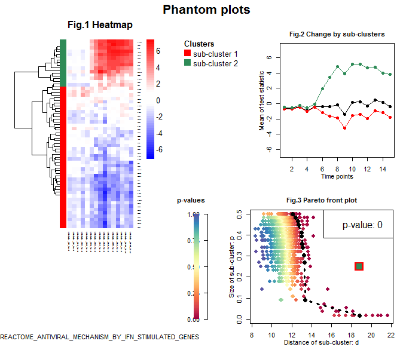

Phantom package is designed to investigate the heterogeneous gene sets in time-course data. There are two different modes of Phantom analysis: Individual gene set mode and batch mode. 


## Phantom individual gene set mode

To run Phantom demo in individual gene set mode, use the following code:
```r
library(phantom)
```
```{r,eval=F}
# load in the demo data and demo geneset reactome geneset in phantom package

data("time.course.data")
data("reactome.geneset")
```
```r
# run individual gene set mode phantom analysis and store the result in an object

obj = run.phantom(data = time.course.data, geneset_list = reactome.geneset,
query_geneset='REACTOME_ANTIVIRAL_MECHANISM_BY_IFN_STIMULATED_GENES', ncluster = 2, nsample = 1000)
```
When executing the `run.phantom` function, the general information of Phantom analysis will be printed on the screen (shown below), and the result figure will be generated. 
```r
## Gene set: REACTOME_ANTIVIRAL_MECHANISM_BY_IFN_STIMULATED_GENES
## Time used for clustering random samples: 0.34 
## Time used for random sampling: 0.36 
## Time used for pareto front test: 0.01 
## 0 
```



The names of all the gene sets in the loaded geneset list, e.g. reactome.geneset, will be put into a vector when running the function `geneset.names`. User can find the name of the query gene set in this vector. 

```{r,eval=F}
# print the names of genesets in reactome.geneset

g.names = geneset.names(reactome.geneset)
g.names

## [1] "REACTOME_GLYCOGEN_BREAKDOWN_GLYCOGENOLYSIS"                                           
## [2] "REACTOME_TRANSLATION""             
## [3] "REACTOME_PYRIMIDINE_CATABOLISM"
## [4] "REACTOME_RNA_POL_III_TRANSCRIPTION_INITIATION_FROM_TYPE_2_PROMOTER"
## ...
```

## Phantom batch mode
To run Phantom in batch mode, use the following code:
```{r,eval=F}
# load in the demo data and demo geneset kegg geneset in phantom package

data("time.course.data")
data("kegg.geneset")
```
```r
# run batch mode phantom analysis and store the result in an object

obj = run.phantom.batch(data = time.course.data, geneset_list = kegg.geneset,
                  maxncluster = 5, nsample = 1000, report_pval = 0.05, report_nmin = 5,
                  output_dir = file.path(getwd(),'/phantom_result'))
```
For Phantom batch mode, the analysis results will be put into a PDF file in the 'phantom_result' subdirectory under current working directory by default. User can also specify the output file directory by modifying the `output_dir` parameter.

## User data and gene set input

User's own input data files can be imported through the following function:
```r
load.data(path-to-input-file)
```
Also, we allow users to provide their own gene set file by using the following command:
```r
load.geneset(path-to-geneset-file)
```


